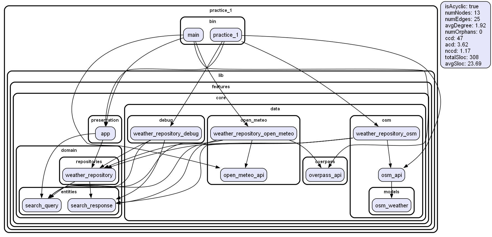

# Приложение для получения текущей погоды в выбранном городе
#### Dart, Flutter
## Курсов Михаил БПМ-22-ПО-3

### Особенности
- Получение координат города через **Overpass API**.
- Получение погодных данных (температура, тип погоды) через **Open-Meteo API**.
- Погода выводится в градусах Цельсия с указанием типа.
- Ключи API не нужны!
### Используемые API
[Overpass API](https://overpass-api.de/) — используется для получения координат города.
[Open-Meteo API](https://open-meteo.com/) — используется для получения данных о погоде.

